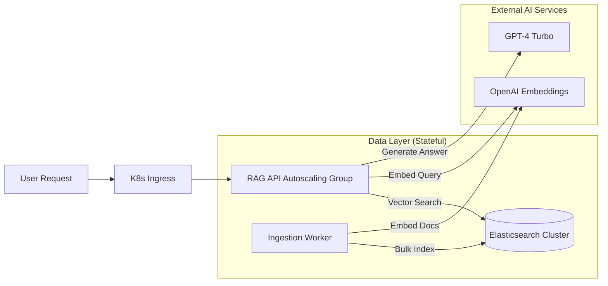

# The Reality Gap in GenAI

Every developer today has built a "Chat with PDF" app in a Jupyter notebook. It takes 50 lines of Python, a free OpenAI key, and a local FAISS index. It feels like magic.

**Then you try to deploy it.**

Suddenly, you face questions that your notebook can't answer:
*   *How do we update the index without downtime?*
*   *What happens when 1,000 users query simultaneously?*
*   *How do we secure the vector database credentials?*

This guide bridges that gap. We will build a **Production-Ready RAG Architecture** that treats vectors as first-class infrastructure, not just a sidecar script.

---

## 🏗️ The Architecture

We aren't just running a script; we are deploying a platform. A production RAG system has two distinct lifecycles: **Ingestion** (keeping data fresh) and **Inference** (answering users fast).

### High-Level Component View



### Why Elasticsearch?
You might ask: *Why not Pinecone or Weaviate?*

While specialized vector DBs are great, Elasticsearch offers a massive advantage for production systems: **Versatility**.

| Feature | Standalone Vector DB | Elasticsearch |
| :--- | :--- | :--- |
| **Vector Search** | ✅ Excellent | ✅ Excellent (kNN) |
| **Lexical Search** | ❌ Weak/None | ✅ Best-in-class (BM25) |
| **Metadata Filtering** | ⚠️ Varies | ✅ Powerful DSL |
| **Ops Maturity** | ⚠️ New tech stacks | ✅ Battle-tested for 10+ years |
| **Data Tiering** | ❌ Costs $$$ | ✅ Hot/Warm/Cold tiers |

In a real app, users don't just search by *meaning* (vector); they search by *date*, *category*, and *keyword*. Elastic handles both seamlessly.

---

## 🎮 The Demo Experience

Before we build it, let's see what "Success" looks like. We are building a system that deploys with a single command and scales efficiently.

### 1. The Deployment
Imagine running a single Helm command to spin up the entire stack:

```bash
$ helm install rag-stack ./charts/rag-stack --namespace rag-prod

NAME: rag-stack
LAST DEPLOYED: Fri Feb 02 10:00:00 2026
NAMESPACE: rag-prod
STATUS: deployed
REVISION: 1
TEST SUITE: None
```

### 2. The Interaction
Once running, our API responds with not just the answer, but the **provenance** (citing sources), which is critical for trust.

**Request:**
```bash
curl -XPOST https://api.rag-demo.com/chat \
  -H "Content-Type: application/json" \
  -d '{"query": "How do I scale the vector db?"}'
```

**Response:**
```json
{
  "answer": "To scale the vector database, you should use Elasticsearch's sharding capabilities. Distribute primary shards across multiple data nodes to parallelize write operations...",
  "sources": [
    {
      "title": "scaling-elasticsearch.md",
      "score": 0.92,
      "excerpt": "Horizontal scaling is achieved by adding more data nodes..."
    },
    {
      "title": "k8s-statefulsets.md",
      "score": 0.88,
      "excerpt": "StatefulSets provide stable network identities for pod replicas..."
    }
  ],
  "latency_ms": 240
}
```

---

## 🚀 Step-by-Step Implementation

We will use **Elastic Cloud on Kubernetes (ECK)**. It's the "official" way to run Elastic on K8s, handling upgrades, security, and certificates automatically.

### Prerequisites
*   A Kubernetes Cluster (Minikube, EKS, GKE, or AKS)
*   `kubectl` installed and configured
*   `helm`
*   OpenAI API Key

### Phase 1: The Infrastructure (DevOps)

**1. Install the ECK Operator**
The operator acts as the brain, managing the Elasticsearch nodes.
```bash
helm repo add elastic https://helm.elastic.co
helm repo update
helm install elastic-operator elastic/eck-operator -n elastic-system --create-namespace
```

**2. Define the Vector Database**
Save this as `Infrastructure/elasticsearch.yaml`. Note the `node.store.allow_mmap` setting, crucial for vector performance.

```yaml
apiVersion: elasticsearch.k8s.elastic.co/v1
kind: Elasticsearch
metadata:
  name: vector-db
spec:
  version: 8.12.0
  nodeSets:
  - name: heavy-hitters
    count: 3
    config:
      node.roles: ["master", "data", "ingest"]
    podTemplate:
      spec:
        containers:
        - name: elasticsearch
          resources:
            requests:
              memory: 2Gi # Production: Start with 8Gi+
              cpu: 1
            limits:
              memory: 4Gi
```

**3. Deploy**
```bash
kubectl apply -f Infrastructure/elasticsearch.yaml
```

---

## 💻 Phase 2: The Code (Development)

We'll separate our concerns into two Python services: **Ingestion** (Write) and **Retrieval** (Read).

### The Ingestion Worker
This script runs as a Kubernetes Job. Ideally, this triggers on git commits or file uploads.

`ingest.py`:
```python
import os
from langchain_community.document_loaders import DirectoryLoader
from langchain_text_splitters import RecursiveCharacterTextSplitter
from langchain_elasticsearch import ElasticsearchStore
from langchain_openai import OpenAIEmbeddings

def main():
    print("🚀 Starting Ingestion Job...")
    
    # 1. Load Data
    # In production, this might pull from S3 or a SQL DB
    loader = DirectoryLoader('./knowledge_base', glob="**/*.txt")
    raw_docs = loader.load()
    
    # 2. Split (Critical for RAG quality)
    # Overlap ensures context isn't lost at chunk boundaries
    text_splitter = RecursiveCharacterTextSplitter(chunk_size=500, chunk_overlap=50)
    docs = text_splitter.split_documents(raw_docs)
    
    print(f"🧩 Split {len(raw_docs)} files into {len(docs)} chunks.")

    # 3. Index to Elastic
    # This automatically creates the index with correct mappings if it doesn't exist
    ElasticsearchStore.from_documents(
        docs,
        OpenAIEmbeddings(),
        es_url=os.getenv("ES_URL"),
        es_api_key=os.getenv("ES_API_KEY"), 
        index_name="production-rag-v1"
    )
    print("✅ Ingestion Complete!")

if __name__ == "__main__":
    main()
```

### The API Service
We use **FastAPI** for high-performance async handling.

`api.py`:
```python
from fastapi import FastAPI, HTTPException
from pydantic import BaseModel
from langchain_openai import ChatOpenAI, OpenAIEmbeddings
from langchain_elasticsearch import ElasticsearchStore
from langchain.prompts import ChatPromptTemplate
from langchain.schema.runnable import RunnablePassthrough
from langchain.schema.output_parser import StrOutputParser

app = FastAPI(title="Enterprise RAG API")

# Define prompt template with strict instructions
template = """Answer the question based ONLY on the following context:
{context}

Question: {question}
"""
prompt = ChatPromptTemplate.from_template(template)
model = ChatOpenAI(model="gpt-4-turbo-preview")

@app.post("/query")
async def query_index(request: QueryRequest):
    try:
        # Setup Vector Store Connection
        # Note: Connections are lightweight in LangChain, but in high-scale
        # you might want to initialize this globally.
        vector_store = ElasticsearchStore(
            es_url=os.getenv("ES_URL"),
            api_key=os.getenv("ES_API_KEY"),
            index_name="production-rag-v1",
            embedding=OpenAIEmbeddings()
        )
        
        # Create the Chain
        # 'k=3' means we fetch the top 3 most relevant chunks
        retriever = vector_store.as_retriever(search_kwargs={"k": 3})
        chain = (
            {"context": retriever, "question": RunnablePassthrough()}
            | prompt
            | model
            | StrOutputParser()
        )
        
        return chain.invoke(request.query)
    except Exception as e:
        # Log this error to your observability platform!
        print(f"Error processing query: {e}")
        raise HTTPException(status_code=500, detail="Internal Processing Error")
```

---

## 🛠️ Day 2 Operations: Keeping it Alive

Deploying is day 1. Keeping it running is day 2. Here is where the "Winning" begins.

### 1. Observability: "If you can't measure it, you can't improve it."
Your notebook doesn't have logs. Your cluster must.
*   **Elastic Agent**: Deploy this alongside your apps to ship logs and metrics *back* into Elasticsearch (yes, monitor ES with ES).
*   **Key Metrics to Watch**:
    *   `search_latency`: if this spikes, your RAG feels slow.
    *   `indexing_rate`: tracking how fast new documents are available.

### 2. Autoscaling (HPA)
Don't pay for idle CPU. Use Kubernetes **Horizontal Pod Autoscalers (HPA)** for the API layer.

```yaml
apiVersion: autoscaling/v2
kind: HorizontalPodAutoscaler
metadata:
  name: rag-api-hpa
spec:
  scaleTargetRef:
    apiVersion: apps/v1
    kind: Deployment
    name: rag-api
  minReplicas: 2
  maxReplicas: 20
  metrics:
  - type: Resource
    resource:
      name: cpu
      target:
        type: Utilization
        averageUtilization: 70
```
This config ensures that when traffic spikes, K8s adds more API pods automatically.

### 3. Security Check
*   **Secrets**: Never maintain `ES_PASSWORD` in plain text. Use [External Secrets Operator](https://external-secrets.io/) to pull from AWS Secrets Manager or Azure Key Vault into K8s Secrets.
*   **TLS**: ECK enables TLS by default. Ensure your Python clients verify SSL certificates to prevent Man-in-the-Middle attacks.

---

## 🏁 Conclusion

RAG is easy to prototype but hard to robustify. By moving to Kubernetes and Elasticsearch, you gain **observability**, **scalability**, and **security** out of the box.

You aren't just building a chatbot; you're building a knowledge engine.

**Next Steps?** clone this repo, run `helm install`, and watch your logs flow. Happy coding!
