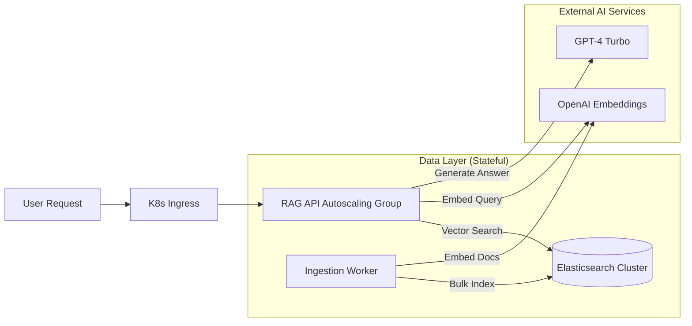
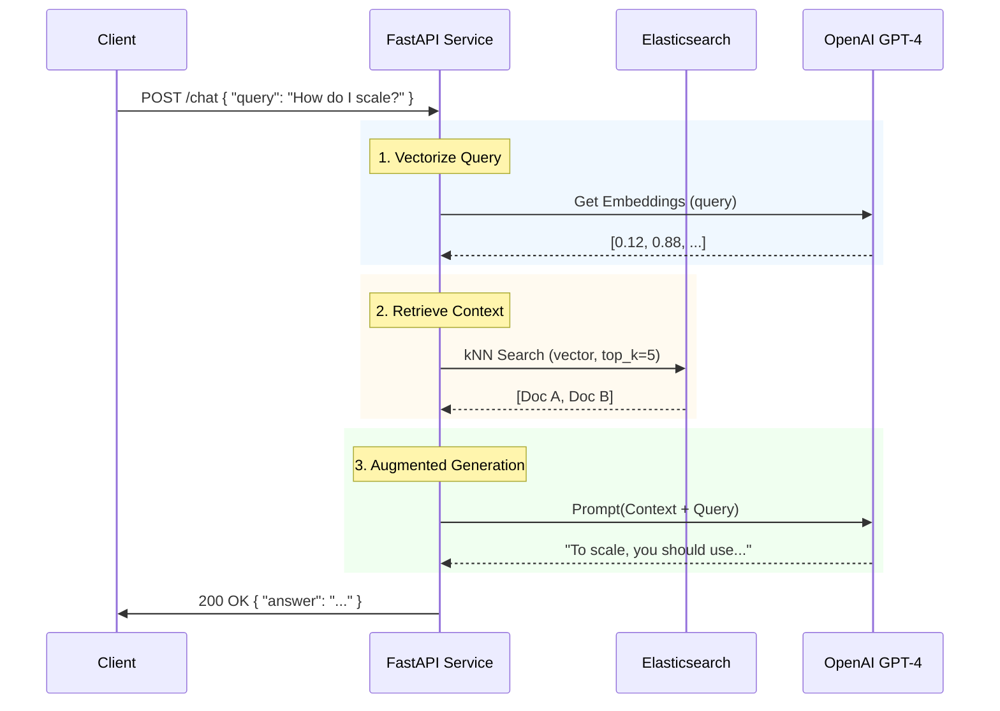

# The Reality Gap in GenAI

Every developer today has built a "Chat with PDF" app in a Jupyter notebook. It takes 50 lines of Python, a free OpenAI key, and a local FAISS index. It feels like magic.

**Then you try to deploy it.**

Suddenly, you face questions that your notebook can't answer:
*   *How do we update the index without downtime?*
*   *What happens when 1,000 users query simultaneously?*
*   *How do we secure the vector database credentials?*

This guide bridges that gap. We will build a **Production-Ready RAG Architecture** that treats vectors as first-class infrastructure, not just a sidecar script.

---

## 🏗️ The Architecture

We aren't just running a script; we are deploying a platform.

### High-Level Component View



### Request Flow Sequence

Understanding the flow is critical for debugging latency.



---

## 🚀 Step-by-Step Implementation

We will use **Elastic Cloud on Kubernetes (ECK)**. It's the "official" way to run Elastic on K8s, handling upgrades, security, and certificates automatically.

### Prerequisites
*   A Kubernetes Cluster (Minikube, EKS, GKE, or AKS)
*   `kubectl` installed and configured
*   `helm`
*   OpenAI API Key

### Phase 1: The Infrastructure (DevOps)

**1. Install the ECK Operator**
The operator acts as the brain, managing the Elasticsearch nodes.
```bash
helm repo add elastic https://helm.elastic.co
helm repo update
helm install elastic-operator elastic/eck-operator -n elastic-system --create-namespace
```

**2. Define the Vector Database**
Save this as `Infrastructure/elasticsearch.yaml`. Note the `node.store.allow_mmap` setting, crucial for vector performance.

```yaml
apiVersion: elasticsearch.k8s.elastic.co/v1
kind: Elasticsearch
metadata:
  name: vector-db
spec:
  version: 8.12.0
  nodeSets:
  - name: heavy-hitters
    count: 3
    config:
      node.roles: ["master", "data", "ingest"]
    podTemplate:
      spec:
        containers:
        - name: elasticsearch
          resources:
            requests:
              memory: 2Gi
              cpu: 1
            limits:
              memory: 4Gi
```

**3. Deploy**
```bash
kubectl apply -f Infrastructure/elasticsearch.yaml
```

**4. Extract Credentials**
The operator automatically generates a secure password.
```bash
PASSWORD=$(kubectl get secret vector-db-es-elastic-user -o go-template='{{.data.elastic | base64decode}}')
echo "Your ES Password is: $PASSWORD"
```

---

## 💻 Phase 2: The Code (Development)

We'll separate our concerns into two Python services: **Ingestion** (Write) and **Retrieval** (Read).

### The Ingestion Worker
This script runs as a Kubernetes Job. It's idempotent—rerunning it updates the index.

`ingest.py`:
```python
import os
from langchain_community.document_loaders import DirectoryLoader
from langchain_text_splitters import RecursiveCharacterTextSplitter
from langchain_elasticsearch import ElasticsearchStore
from langchain_openai import OpenAIEmbeddings

def main():
    print("🚀 Starting Ingestion...")
    
    # 1. Load Data
    loader = DirectoryLoader('./knowledge_base', glob="**/*.txt")
    raw_docs = loader.load()
    
    # 2. Split (Critical for RAG quality)
    text_splitter = RecursiveCharacterTextSplitter(chunk_size=500, chunk_overlap=50)
    docs = text_splitter.split_documents(raw_docs)
    
    print(f"🧩 Split {len(raw_docs)} files into {len(docs)} chunks.")

    # 3. Index to Elastic
    ElasticsearchStore.from_documents(
        docs,
        OpenAIEmbeddings(),
        es_url=os.getenv("ES_URL"),
        es_api_key=os.getenv("ES_API_KEY"), # Use API Keys in prod!
        index_name="production-rag-v1"
    )
    print("✅ Ingestion Complete!")

if __name__ == "__main__":
    main()
```

### The API Service
We use **FastAPI** for high-performance async handling.

`api.py`:
```python
from fastapi import FastAPI, HTTPException
from pydantic import BaseModel
from langchain_openai import ChatOpenAI, OpenAIEmbeddings
from langchain_elasticsearch import ElasticsearchStore
from langchain.prompts import ChatPromptTemplate
from langchain.schema.runnable import RunnablePassthrough
from langchain.schema.output_parser import StrOutputParser

app = FastAPI(title="Entperprise RAG API")

# Define our prompt template strictly
template = """Answer the question based ONLY on the following context:
{context}

Question: {question}
"""
prompt = ChatPromptTemplate.from_template(template)
model = ChatOpenAI(model="gpt-4-turbo-preview")

@app.post("/query")
async def query_index(request: QueryRequest):
    # Setup Vector Store Connection
    vector_store = ElasticsearchStore(
        es_url=os.getenv("ES_URL"),
        api_key=os.getenv("ES_API_KEY"),
        index_name="production-rag-v1",
        embedding=OpenAIEmbeddings()
    )
    
    # Create the Chain
    retriever = vector_store.as_retriever(search_kwargs={"k": 3})
    chain = (
        {"context": retriever, "question": RunnablePassthrough()}
        | prompt
        | model
        | StrOutputParser()
    )
    
    return chain.invoke(request.query)
```

---

## 🛡️ Production Checklist

Before you declare victory, go through this checklist. If you check all boxes, you are ready for traffic.

- [ ] **Secret Management**: Are OpenAI keys and ES passwords stored in K8s Secrets (or Vault), not env vars?
- [ ] **Rate Limiting**: Add Redis-based rate limiting to the FastAPI app to prevent bill shock.
- [ ] **Readiness Probes**: Configure `/health` endpoints so K8s doesn't send traffic to dead pods.
- [ ] **Index Lifecycle**: Setup ILM policies in Elastic to delete old logs/indices automatically.

## 🏁 Conclusion

RAG is easy to prototype but hard to robustify. By moving to Kubernetes and Elasticsearch, you gain **observability**, **scalability**, and **security** out of the box.

**Next Steps?** clone this repo, run `helm install`, and watch your logs flow. Happy coding!
